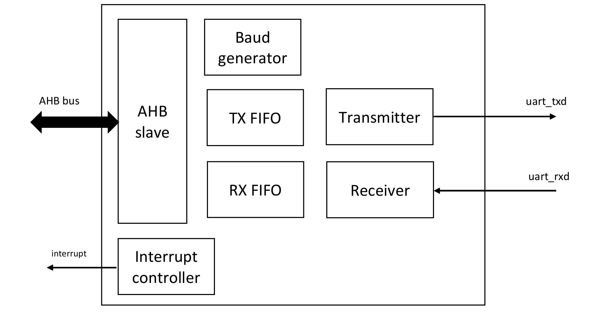
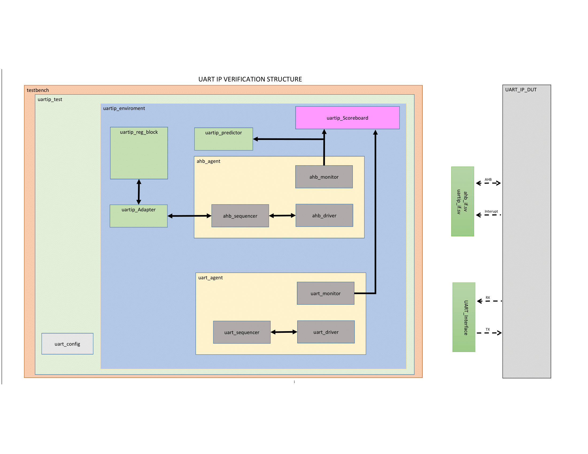

# UART IP verification by using UVM
## Introduce
My name is Nguyen Van Huy, and I am a course participant at ICTC (IC Training Center Vietnam). This article presents my work on develop and validate UART IP, a final project I have completed as part of my course at ICTC. The goal of this article is to show the knowledge and skills I have gained through my studies at ICTC and to demonstrate my abilities to potential employers in the field of Design Verification.

The Universal Asynchronous Receiver/Transmitter (**UART**) performs **serial-to-parallel** conversion for data received from a **peripheral device** and **parallel-to-serial** conversion for data received from the **CPU**. It includes **timing control** and an **interrupt system** to minimize **software overhead**.

## Summary of Specification for UART IP
In this section, I have summarized the key points from the "UART IP Specification" provided by the center. For further details, please refer to the full documents linked below:
- [UART IP Specification Document](https://github.com/huynv1212/UartIP_Verification/blob/562d4d736ee47417cfaeda03a0063d142fdf87ad/UART%20IP%20Specification%20Version%202.0.pdf).
  
Summary uart specification:

**Introduction**

UART performs serial-to-parallel and parallel-to-serial data conversion, supporting AHB Lite protocol, a programmable baud generator, and 16-byte TX/RX FIFOs. Configurable serial interface features include data bits (5, 6, 7, 8), parity (even/odd), and stop bits (1 or 2).

- Block Diagram: Includes AHB bus, baud generator, TX FIFO, RX FIFO, transmitter, receiver, and interrupt signals.

  
  
- AHB Interface Signals: hclk, hresetn, haddr, hburst, hmastlock, hprot, hsize, hsel, htrans, hwdata, hwrite, hrdata, hreadyout, hresp.
- UART Interface Signals: uart_txd, uart_rxd.
- Interrupt signal: interrupt.

**Operation**

The UART supports the following operations:

- Data Transmission: Transmits data from the CPU to an external device through the uart_txd line.
- Data Reception: Receives data from an external device and transfers it to the CPU through the uart_rxd line.
- Error Handling: Includes mechanisms to detect and handle errors like FIFO overflows and underflows.
  
**Register Definition**

The UART IP includes the following important registers:

- MDR (Mode Definition Register): Defines operational modes, such as selecting oversampling modes (16x or 13x).
- DLL/DLH (Divisor Latches): Used to program the divisor value for the baud rate generator.
- LCR (Line Control Register): Configures data bits, parity, and stop bits for data transmission and reception.
- IER (Interrupt Enable Register): Enables specific interrupt sources.
- FSR (FIFO Status Register): Provides the status of the TX and RX FIFOs.
- TBR (Transmitter Buffer Register): Holds data to be transmitted.
- RBR (Receiver Buffer Register): Holds received data.

## Tools and Methodology Used
Tools and Methodology Used
- Language: SystemVerilog for writing testbenches and verification components.
- Methodology: UVM for building a structured and reusable verification environment.
- EDA Tool: QuestaSim for simulation and debugging.
- 
## Verification Structure Design
Below is a picture describing the Testbench structure to verify the VIP

The UART IP Verification Environment is designed based on UVM (Universal Verification Methodology) to ensure the correctness and reliability of the UART IP. This environment includes various components responsible for generating test cases, driving stimulus, monitoring transactions, and verifying the transmitted and received data

**Testbench**

The testbench serves as the foundation of the verification environment. It includes:

- Multiple interfaces that communicate with the DUT (Device Under Test).
- Initialization of input and output values within these interfaces.
- A clock generator that supplies the system clock

**uartip_test**

The uartip_test class is responsible for managing the test execution. It includes:

- uart_config: Defines the UART configurations (such as baud rate, data bits, stop bits, etc.).
- Creates test scenarios by setting up the specific test cases to be run.
- Uartip_environment, which serves as the simulation environment and contains all essential verification components.

**uartip_environment**

The uartip_environment consists of multiple verification blocks:

**uartip_reg_block**

- Manages the registers of the UART IP.
- Handles register read and write operations.

**uartip_Adapter & uartip_Predictor**

- uartip_Adapter updates the read/write values into reg_model (uartip_reg_block).
- uartip_Predictor predicts expected results based on input values and ensures the DUT functions correctly.

**uartip_Scoreboard**

- Collects transactions from ahb_monitor and uart_monitor.
- Compares actual vs. expected results to verify data integrity in both transmission and reception processes.
- Performs functional coverage analysis to ensure the test scenarios cover all required features.

**uart_agent**

- Responsible for transmitting data to the UART IP via TX.
- Receives data transmitted by the UART IP via RX.
- Sends transmisting and Received values and transaction details to the scoreboard for verification.
  
**Note: the uart agent has been developed using the UART VIP. Please refer to the following article: "[uart validate](https://github.com/huynv1212/UartVIP_Validate.git)" to learn more**
**ahb_agent**

- Reads and writes register values to configure UART IP.
- Ensures the UART IP correctly executes transmission and reception operations.
- Sends register values and transaction details to the scoreboard for verification.

## Verification Plan Design
COMING SOON!
## Verification Environment Design and Develop
COMING SOON!
## Simulation and Waveform
COMING SOON!
## Conclusion and Acknowledgment
COMING SOON!
